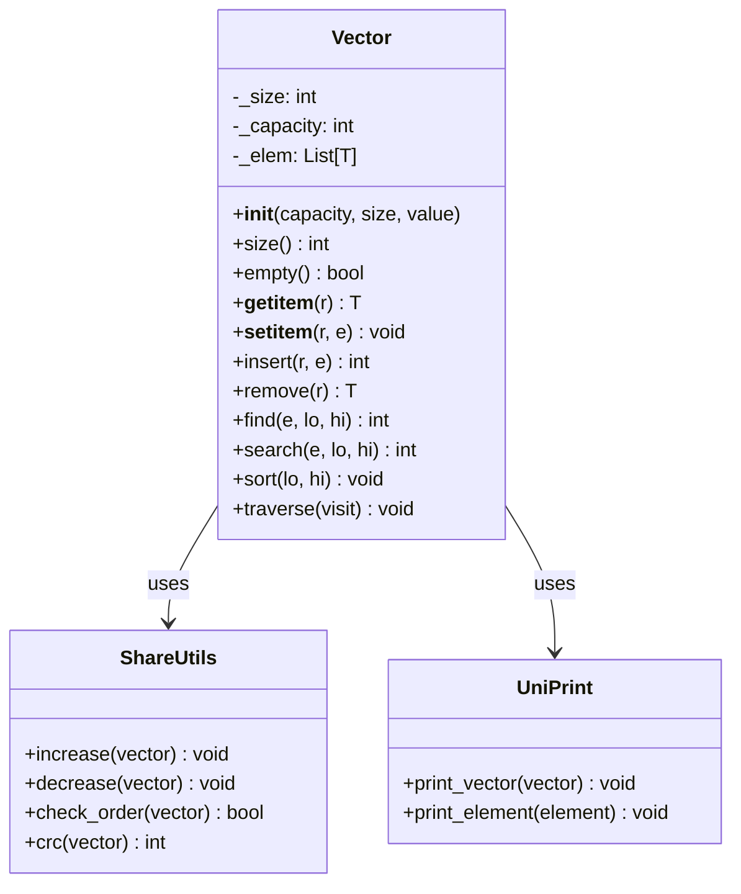
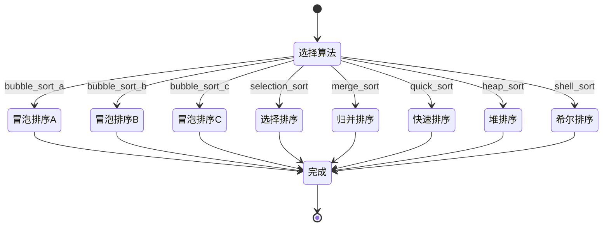
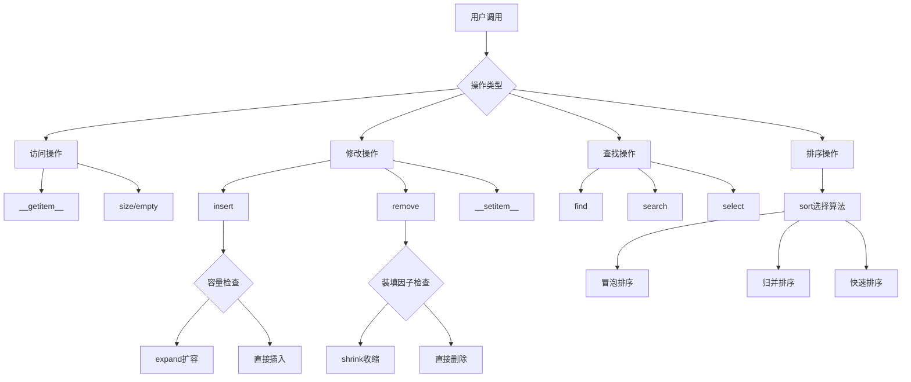
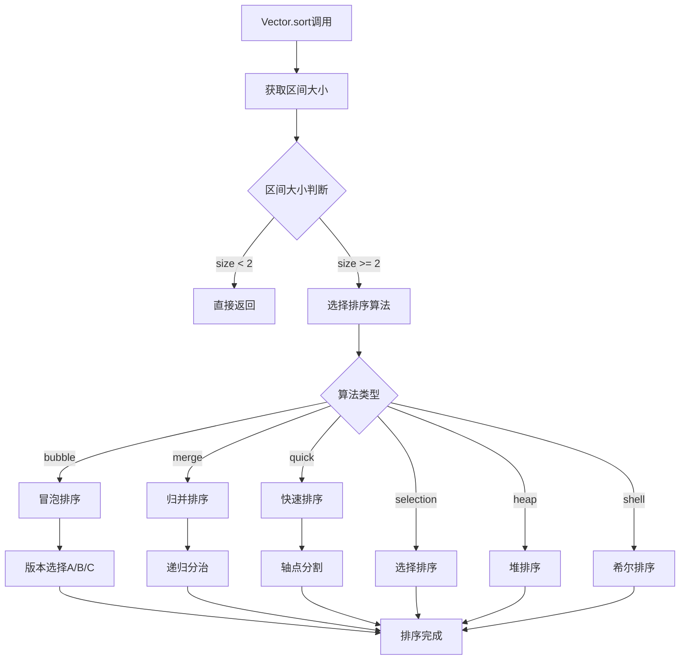

# Vector类Python实现设计文档

## 1. 概述

本项目将把C++实现的Vector动态数组类完全转换为Python版本，保持原有的数据结构学习目的和核心算法逻辑。Vector类是一个教学用的动态数组实现，包含了丰富的排序算法、查找算法和向量操作。

### 设计目标
- 完全基于C++版本的逻辑重新实现
- 保持Python编程风格和习惯
- 保留教学用途，不使用Python内置算法替代
- 实现所有核心功能和算法变种

## 2. 技术栈与依赖

### 核心技术
- **语言**: Python 3.8+
- **类型系统**: 使用typing模块进行类型提示
- **泛型支持**: TypeVar实现模板类功能

### 依赖模块
```python
from typing import TypeVar, Generic, List, Optional, Callable, Any
import random
import time
import math
```

## 3. 核心架构设计

### 3.1 Vector类定义



### 3.2 模块结构

```
vector_py/
├── vector.py                    # 主Vector类定义
├── vector_algorithms/          # 算法实现模块
│   ├── __init__.py
│   ├── sort_algorithms.py      # 排序算法集合
│   ├── search_algorithms.py    # 查找算法集合
│   └── vector_operations.py    # 向量操作
├── _share/                     # 共享工具模块
│   ├── __init__.py
│   ├── util.py                # 工具函数
│   └── vector_utils.py        # Vector专用工具
├── uni_print/                  # 打印输出模块
│   ├── __init__.py
│   └── print_vector.py        # Vector打印功能
└── test/
    └── vector_test.py         # 测试文件
```

## 4. Vector类核心功能设计

### 4.1 基础属性与构造

| 属性 | 类型 | 说明 |
|-----|-----|-----|
| _size | int | 当前元素数量 |
| _capacity | int | 容量大小 |
| _elem | List[T] | 元素存储列表 |

### 4.2 构造方法设计

```python
class Vector(Generic[T]):
    def __init__(self, capacity: int = 3, size: int = 0, value: Optional[T] = None):
        """
        Args:
            capacity: 初始容量
            size: 初始大小 
            value: 初始值填充
        """
    
    @classmethod
    def from_array(cls, array: List[T], lo: int = 0, hi: Optional[int] = None):
        """从数组区间构造"""
        
    @classmethod 
    def from_vector(cls, vector: 'Vector[T]', lo: int = 0, hi: Optional[int] = None):
        """从另一个Vector构造"""
```

### 4.3 核心接口方法

| 方法 | 返回类型 | 功能描述 |
|-----|---------|---------|
| `size()` | int | 获取向量规模 |
| `empty()` | bool | 判断是否为空 |
| `__getitem__(r)` | T | 访问第r个元素 |
| `__setitem__(r, e)` | None | 设置第r个元素 |
| `insert(r, e)` | int | 在位置r插入元素e |
| `remove(r)` | T | 删除位置r的元素 |
| `remove_interval(lo, hi)` | int | 删除区间[lo,hi)内元素 |

### 4.4 查找功能设计

#### 无序向量查找
```python
def find(self, e: T, lo: int = 0, hi: Optional[int] = None) -> int:
    """在无序向量[lo, hi)中查找元素e，返回最大的匹配秩"""
    
def select(self, k: int) -> T:
    """从无序向量中找到第k大的元素"""
```

#### 有序向量查找
```python
def search(self, e: T, lo: int = 0, hi: Optional[int] = None) -> int:
    """在有序向量[lo, hi)中查找元素e"""

# 二分查找的三个版本
def _binary_search_a(self, e: T, lo: int, hi: int) -> int:
    """二分查找版本A - 基础版本"""
    
def _binary_search_b(self, e: T, lo: int, hi: int) -> int: 
    """二分查找版本B - 改进版本"""
    
def _binary_search_c(self, e: T, lo: int, hi: int) -> int:
    """二分查找版本C - 最优版本"""

# 斐波那契查找
def _fibonacci_search_a(self, e: T, lo: int, hi: int) -> int:
    """斐波那契查找版本A"""
    
def _fibonacci_search_b(self, e: T, lo: int, hi: int) -> int:
    """斐波那契查找版本B"""
```

## 5. 排序算法架构

### 5.1 排序算法接口设计

```python
class SortAlgorithms:
    @staticmethod
    def bubble_sort_a(vector: 'Vector[T]', lo: int, hi: int) -> None:
        """冒泡排序版本A - 基础版"""
        
    @staticmethod  
    def bubble_sort_b(vector: 'Vector[T]', lo: int, hi: int) -> None:
        """冒泡排序版本B - 改进版"""
        
    @staticmethod
    def bubble_sort_c(vector: 'Vector[T]', lo: int, hi: int) -> None:
        """冒泡排序版本C - 跳跃版"""
        
    @staticmethod
    def selection_sort(vector: 'Vector[T]', lo: int, hi: int) -> None:
        """选择排序"""
        
    @staticmethod 
    def merge_sort(vector: 'Vector[T]', lo: int, hi: int) -> None:
        """归并排序"""
        
    @staticmethod
    def quick_sort(vector: 'Vector[T]', lo: int, hi: int) -> None:
        """快速排序"""
        
    @staticmethod
    def heap_sort(vector: 'Vector[T]', lo: int, hi: int) -> None:
        """堆排序"""
        
    @staticmethod
    def shell_sort(vector: 'Vector[T]', lo: int, hi: int) -> None:
        """希尔排序"""
```

### 5.2 排序算法状态图



## 6. 共享工具模块设计

### 6.1 _share/util.py

```python
from typing import TypeVar, Callable
import random
import time

T = TypeVar('T')

def max_val(a: T, b: T) -> T:
    """最大值函数"""
    
def min_val(a: T, b: T) -> T:
    """最小值函数"""
    
def dice(range_val: int) -> int:
    """随机数生成"""
    
def swap(arr: list, i: int, j: int) -> None:
    """交换数组中两个元素"""
```

### 6.2 _share/vector_utils.py

```python
from typing import TypeVar
from vector import Vector

T = TypeVar('T')

class Increase:
    """元素递增函数对象"""
    def __call__(self, x: T) -> T:
        return x + 1

class Decrease:  
    """元素递减函数对象"""
    def __call__(self, x: T) -> T:
        return x - 1

def increase_vector(vector: Vector[T]) -> None:
    """统一递增向量的各元素"""
    inc = Increase()
    vector.traverse(inc)

def decrease_vector(vector: Vector[T]) -> None:
    """统一递减向量的各元素"""
    dec = Decrease()  
    vector.traverse(dec)

def check_order_vector(vector: Vector[T]) -> bool:
    """检查向量是否有序"""
    for i in range(1, vector.size()):
        if vector[i-1] > vector[i]:
            return False
    return True

def crc_vector(vector: Vector[T]) -> int:
    """计算向量的CRC校验值"""
    crc = 0
    for i in range(vector.size()):
        crc = (crc * 131 + hash(vector[i])) % (2**32)
    return crc
```

## 7. 打印输出模块设计

### 7.1 uni_print/print_vector.py

```python
from typing import TypeVar, Any, Callable
from vector import Vector

T = TypeVar('T')

class UniPrint:
    @staticmethod
    def print_element(element: Any) -> None:
        """打印单个元素"""
        print(f" {element}", end="")
        
    @staticmethod  
    def print_vector(vector: Vector[T]) -> None:
        """打印向量"""
        class_name = vector.__class__.__name__
        address = id(vector)
        size = vector.size()
        
        print(f"{class_name}[{address}]*{size}:")
        vector.traverse(UniPrint.print_element)
        print()

def print_any(obj: Any) -> None:
    """通用打印函数"""
    if hasattr(obj, 'traverse') and hasattr(obj, 'size'):
        UniPrint.print_vector(obj)
    else:
        UniPrint.print_element(obj)

# 宏定义等效功能        
def PRINT(obj: Any) -> None:
    """等效于C++的PRINT宏"""
    print_any(obj)
    if hasattr(obj, 'traverse') and hasattr(obj, 'size'):
        from _share.vector_utils import crc_vector, check_order_vector
        crc_vector(obj)
        check_order_vector(obj) 
    print()
```

## 8. 数据流架构

### 8.1 Vector操作数据流



### 8.2 算法选择流程



## 9. 核心算法实现策略

### 9.1 动态扩容策略

| 操作 | 触发条件 | 策略 | 时间复杂度 |
|-----|---------|------|-----------|
| expand() | _size >= _capacity | 容量翻倍 | O(n) |
| shrink() | _size < _capacity/4 | 容量减半 | O(n) |

### 9.2 查找算法比较

| 算法 | 适用场景 | 时间复杂度 | 空间复杂度 |
|-----|---------|-----------|-----------|
| 顺序查找 | 无序向量 | O(n) | O(1) |
| 二分查找A | 有序向量-基础版 | O(log n) | O(1) |
| 二分查找B | 有序向量-改进版 | O(log n) | O(1) |  
| 二分查找C | 有序向量-最优版 | O(log n) | O(1) |
| 斐波那契查找 | 有序向量-特殊情况 | O(log n) | O(1) |

### 9.3 排序算法性能对比

| 算法 | 平均时间 | 最坏时间 | 空间复杂度 | 稳定性 |
|-----|---------|---------|-----------|-------|
| 冒泡排序 | O(n²) | O(n²) | O(1) | 稳定 |
| 选择排序 | O(n²) | O(n²) | O(1) | 不稳定 |
| 归并排序 | O(n log n) | O(n log n) | O(n) | 稳定 |
| 快速排序 | O(n log n) | O(n²) | O(log n) | 不稳定 |
| 堆排序 | O(n log n) | O(n log n) | O(1) | 不稳定 |
| 希尔排序 | O(n^1.3) | O(n²) | O(1) | 不稳定 |

## 10. 测试架构设计

### 10.1 测试用例设计

```python
class VectorTest:
    def test_constructor(self):
        """测试构造函数"""
        
    def test_access_operations(self):
        """测试访问操作"""
        
    def test_modify_operations(self):
        """测试修改操作"""
        
    def test_search_operations(self):
        """测试查找操作"""
        
    def test_sort_algorithms(self):
        """测试排序算法"""
        
    def test_edge_cases(self):
        """测试边界情况"""

    def test_performance(self):
        """性能测试"""
```

### 10.2 测试数据生成策略

| 测试场景 | 数据特征 | 用途 |
|---------|---------|------|
| 空向量 | size=0 | 边界测试 |
| 单元素 | size=1 | 基础功能 |
| 小规模 | size=10 | 算法正确性 |
| 中等规模 | size=1000 | 性能测试 |
| 大规模 | size=10000+ | 压力测试 |
| 已排序 | 升序数据 | 最好情况 |
| 逆序 | 降序数据 | 最坏情况 |
| 随机 | 随机分布 | 平均情况 |
| 重复元素 | 大量重复 | 特殊情况 |

## 11. 实现优先级

### 阶段一：核心框架
1. Vector基础类定义
2. 构造函数和基本访问方法
3. 插入和删除操作
4. 基础的打印输出功能

### 阶段二：查找功能
1. 顺序查找实现
2. 二分查找各版本实现  
3. 斐波那契查找实现
4. 快速选择算法

### 阶段三：排序算法
1. 冒泡排序三个版本
2. 选择排序
3. 归并排序
4. 快速排序
5. 堆排序和希尔排序

### 阶段四：完善功能
1. 去重操作(dedup/uniquify)
2. 完整的_share工具模块
3. 完整的uni_print模块
4. 综合测试用例

## 12. 兼容性与扩展性

### 12.1 Python特性适配
- 使用魔法方法实现操作符重载
- 利用生成器优化大数据遍历
- 支持上下文管理器协议
- 实现迭代器接口

### 12.2 类型安全
- 全面的类型提示支持
- 泛型约束和边界检查
- 运行时类型验证(可选)

### 12.3 扩展接口
- 支持自定义比较函数
- 支持函数式编程风格
- 预留算法插件接口
- 支持并行化扩展